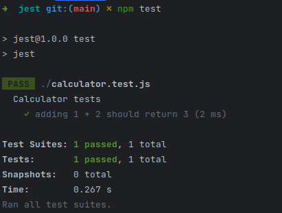
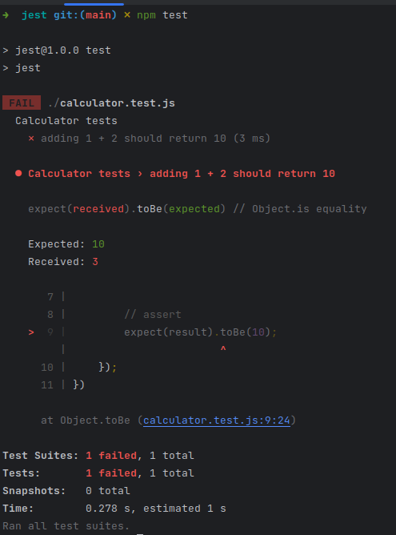
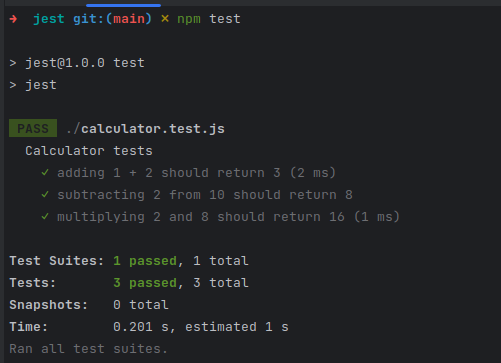

<div dir="rtl">

## آشنایی با jest و استفاده از آن

### فهرست 📝
- [نویسندگان](#نویسندگان)
- [آشنایی با jest](#آشنایی-با-jest)
- [نصب و راه اندازی jest](#نصب-و-راه-اندازی-jest)
- [نوشتن تست برای یک تابع](#نوشتن-تست-برای-یک-تابع)
- [تطابق دهنده (matcher)](#تطابق-دهنده-matcher)
- [آزمایش ناهمگام](#آزمایش-ناهمگام)
  - [1. callback and done](#1-callback-and-done-)
  - [2. Promises](#2-promises)
  - [3. async/await](#3-asyncawait)
- [منابع](#منابع)
- [نتیجه گیری](#نتیجه-گیری)

### نویسندگان ✍️

- [احسان رحمانی میاب](https://github.com/Ehsanino82)
- [شایان شعبانی](https://github.com/shayanshabani)
- [امیرمهدی میقانی](https://github.com/amirmm03)

## آشنایی با jest
<p align=center></p>

ابزار Jest یک فریمورک محبوب با ویژگی های متنوع برای نوشتن تست در جاوا اسکریپت است که توسط facebook توسعه داده شده است و همچنین با تمامی فریمورک های محبوب جاوا اسکریپت مانند React, Angular, Vue, Node و … کار میکند. البته لازم به ذکر است که مقصود اصلی برای unit testing برای پروژه های react بوده است.

در ادامه به برخی از ویژگی های مهم jest میپردازیم.

- نیاز نداشتن به پیکر بندی : Jest کار را بسیار راحت کرده و نیاز به هیچ تنظیمات یا پیکربندی خاصی ندارد. در بیشتر فریمورک های مدرن به صورت out of the box است و نیاز به تنظیمات خاصی ندارد. بنابراین استفاده از آن باعث صرفه جویی در وقت میشود.

- وجود Mocking ساده : Jest نوشتن mock functions  را بسیار ساده میکند. منظور از mock functions توابعی هستند که به صورت شبیه سازی شده رفتار توابع واقعی را تقلید میکنند. Jest از یک سری resolver های سفارشی برای import  تست ها استفاده میکند بنابراین mock کردن هر object در خارج از محدوده تست شما بسیار آسان می شود.

- ساپورت از Snapshots : فریمورک Jest از snapshots  استفاده میکند که باعث میشود بتوان به صورت سازمان یافته تست object های بزرگ رو ردیابی کرد. در علم کامپیوتر snapshot در واقع یک کپی از وضعیت سیستم در یک نقطه ی خاص است. ابن ویژگی زمانی مناسب است که یک object بزرگ را در redux store ذخیره کرده و قصد داشته داده های آن را validate کرد.

- انجام تست ها به صورت موازی : این یکی از ویژگی های متمایز Jest است و برای توسعه سریع خلی مناسب است. تست ها به صورت موازی و جدا از هم اجرا می شوند. از آنجایی که هر کدوم فرآیندهای خاص خودشان را دارند، عملکرد به حداکثر میرسه و این موضوع باعث میشود تا در سرعت نیز تاثیرگذار باشد. همچنین همچنین در ابتدا تست های شکست خورده قبلی را انجام میدهد و انجام تست ها را بر اساس زمان طول کشیدن آنها دوباره سازماندهی میکند.

- Code Coverage : فریمورک Jest میتواند با استفاده از دستور  `coverage–` به راحتی یک code coverage ایجاد کند و نیاز به هیچ تنظیمات خاصی ندارد. این ویژگی میتواند برای ارزیابی test case ها و پیش بینی اینکه به چند مورد تست دیگر برای پوشش بهتر نیاز است، مفید باشد.

## نصب و راه اندازی jest
در حقیقت jest یک پکیج نود است بنابراین میتوان آن را با استفاده از npm آن را نصب کرد.

<div dir="ltr">

```bash
npm install -g jest
```
</div>

برای استفاده از jest فقط در پروژه های بر پایه ی node کافی است که از کامند زیر استفاده کنیم. این کامند باعث میشود که ماژول jest و تمام dependency هایش نصب شوند.

<div dir="ltr">

```bash
npm install --save-dev jest
```
</div>

اکنون کافی است تا npm test script را طوری تنظیم کنیم که تست های jest را اجرا کند. یعنی هنگامی که کامند `npm test` اجرا شد، تمام تست های jest اجرا شوند. برای این کار باید فایل `packege.json` را به صورت زیر آپدیت کنیم.

<div dir="ltr">

```json
{
 "name": "jest-e2e",
 "version": "1.0.0",
 "description": "",
 "main": "index.js",
 "scripts": {
   "test": "jest"
 },
 "author": "",
 "license": "ISC",
 "dependencies": {
   "jest": "^25.1.0"
 }
}
```
</div>


## نوشتن تست برای یک تابع
در این قسمت قصد داریم در ابتدا یک تابع ساده به زبان جاوااسکریپت بنویسیم و سپس تست هایی مناسب برای آن بنویسیم. ابتدا در پروژه ای که پیشتر آن را کانفیگ کردیم یک فایل به اسم `calculator.js` با محتویات زیر میسازیم.

<div dir="ltr">

```javascript
const mathOperations = {
  sum: function(a,b) {
    return a + b;
  },

  diff: function(a,b) {
    return a - b;
  },
  product: function(a,b) {
    return a * b
  }
}
module.exports = mathOperations
```
</div>

اکنون یک فایل `calculator.test.js` میسازیم. دقت کنید که بهتر است که نام فایل های تست به صورت گفته شده باشد تا زیرا که فریمورک jest این فایل ها را شناسایی میکند. همچنین برای اینکه بتوانیم تابع نوشته شده را تست کنیم باید آن را درون فایل تستمان import کنیم. بنابراین خط زیر را درون فایل `calculator.test.js` قرار میدهیم.

<div dir="ltr">

```javascript
const mathOperations = require('./calculator');
```
</div>
اکنون برای توابع مختلفی که نوشته بودیم تست مینویسیم.

با توجه به اینکه jest از BDD (Behavior Driven Development) پیروی میکند، بنابراین هر test suite یک بلاک describe دارد و میتواند چندین تست داشته باشد. البته لازم به ذکر است که تست ها میتوانند describe ها تودرتو داشته باشند.
اکنون یک تست برای تابع `sum()` مینویسیم.

<div dir="ltr">

```javascript
describe("Calculator tests", () => {
 test('adding 1 + 2 should return 3', () => {
   expect(mathOperations.sum(1, 2)).toBe(3);
 });
})
```
</div>

نکاتی در رابطه با تست نوشته شده که مهم هستند:
- باید توجه کرد که محتوای describe مربوط به تمام test suite است و باید چیزی باشد که تمامی تست ها را در برگیرد.
- در ادامه یک تست داریم که نام آن `'adding 1 + 2 should return 3'` قرار داده شده است.
- در ادامه یک بلاک except داریم که بیان میکند که ادعا میکنیم تابع مورد نظر با ورودی های داده شده چه نتیجه ای خواهد داشت.

توجه کنید که میتوانستیم تست بالا را به صورت زیر نیز بنویسیم که در فهم و خوانایی راحت تر است.

<div dir="ltr">

```javascript
describe("Calculator tests", () => {
  test('adding 1 + 2 should return 3', () => {
    // arrange and act
    var result = mathOperations.sum(1,2)

    // assert
    expect(result).toBe(3);
  });
})
```
</div>

اکنون برای اجرای تست نوشته شده کامند `npm test` را اجرا میکنیم.

<p align=center></p>

اکنون یک تست اشتباه مینویسیم تا ببینیم با چه پیغامی روبه رو میشویم. بدین منظور تست نوشته شده را به صورت زیر تغییر میدهیم:

<div dir="ltr">

```javascript
describe("Calculator tests", () => {
  test('adding 1 + 2 should return 10', () => {
    // arrange and act
    var result = mathOperations.sum(1,2)

    // assert
    expect(result).toBe(10);
  });
})
```
</div>

در تست بالا انتظار داریم که حاصل جمع دو عدد ۱ و ۲ عدد ۱۰ شود که نادرست است. (البته که در نوشتن تست برای تابع مورد نظر باید انتظار درستی داشت اما اینجا برای نشان دادن fail شدن تست انتظار نادرستی را از تابع داریم.)

مجددا برای اجرای تست نوشته شده کامند `npm test` را اجرا میکنیم.

<p align=center></p>

همانطور که مشاهده میکنید، جزئیاتی را مشاهده میکنیم به طور مثال اینکه مقدار مورد انتظار چه بوده و مقدار واقعی که تابع بازگردانده چه بوده و اینکه چه خطی از تست دچار مشکل بوده است و ... .

در نهایت سعی میکنیم چندین تست را در یک test suite ینوسیم و آنها را با هم اجرا کنیم. بدین منظور تست ها را به صورت زیر تغییر میدهیم.

<div dir="ltr">

```javascript
const mathOperations = require('./calculator');

describe("Calculator tests", () => {
  test('adding 1 + 2 should return 3', () => {
    // arrange and act
    var result = mathOperations.sum(1,2)

    // assert
    expect(result).toBe(3);
  });

  test("subtracting 2 from 10 should return 8", () => {
    // arrange and act
    var result = mathOperations.diff(10,2)

    // assert
    expect(result).toBe(8);
  });

  test("multiplying 2 and 8 should return 16", () => {
    // arrange and act
    var result = mathOperations.product(2,8)

    // assert
    expect(result).toBe(16);
  });
})
```
</div>

مجددا برای اجرای تست های نوشته شده کامند `npm test` را اجرا میکنیم.

<p align=center></p>

## تطابق دهنده (matcher)
در جست از توابع خاصی برای بررسی درست یا غلط بودن برنامه ها استفاده میشود. با یک مثال ساده شروع میکنیم. همان مثال جمع دو عدد را درنظر بگیرید:
<div dir="ltr">

```javascript
describe("Calculator tests", () => {
 test('adding 1 + 2 should return 3', () => {
   expect(mathOperations.sum(1, 2)).toBe(3);
 });
})
```
</div>
تابع expect به ما یک آبجت از جنس expectation میدهد که معمولا با صدا زدن توابع مچر این ابجکت ها ما نتیجه را بررسی میکنیم و درست یا غلط بودن برنامه را متوجه میشویم. در ادامه با برخی مچر های پر کاربرد آشنا میشویم.

- toBe

به طور دقیق تساوی را چک میکند. درواقع از تابع Object.is استفاده میکند.
- toEqual

اگر مقادیر داخل یک شی را بخواهیم بررسی کنیم از این تابع استفاده میکنیم زیرا به طور بازگشتی مقدار هر فیلد را در شی و آرایه چک میکند
<div dir="ltr">

```javascript
test('object equality', () => {
  const testobject = {one: 1};
  testobject['two'] = 2;
  expect(testobject).toEqual({one: 1, two: 2});
});
```
</div>

- not

اگر به دنبال برعکس یک مچر باشیم کافی است قبل آن از not استفاده کنیم.
<div dir="ltr">

```javascript
test('check not', () => {
  expect(1).not.toBe(2);
});
```
</div>

- toBeNull, toBeUndefined, toBeDefined

همان طور که از نام این مچر ها پیداست، میتوان null بودن و undefined بودن را چک کرد. با یک مثال نشان میدهیم:
<div dir="ltr">

```javascript
test('null', () => {
  const n = null;
  expect(n).toBeNull(); //pass
  expect(n).toBeDefined(); //pass
  expect(n).not.toBeUndefined(); //pass
});
```
</div>

- toBeTruthy, toBeFalsy

برای بررسی عبارات بولین استفاده میشوند. toBeTruthy با هر چه که در if به عنوان true شناخته میشود مچ میشود. toBeFalsy با هر چه که در if به عنوان false شناخته میشود مچ میشود.

- toBeGreaterThan, toBeLessThan, toBeGreaterThanOrEqual, toBeLessThanOrEqual

این مچر ها دقیقا با همان که در نامشان آمده مچ میشوند:
<div dir="ltr">

```javascript
test('one plus two', () => {
  const value = 1 + 2;
  expect(value).toBeGreaterThan(2);
  expect(value).toBeGreaterThanOrEqual(2.5);
  expect(value).toBeLessThan(5);
  expect(value).toBeLessThanOrEqual(4.5);
});
```
</div>

- toMatch

مواقع زیادی نیاز است که یک رشته را با یک regex مچ کنیم و بررسی کنیم که این اتفاق رخ میدهد یا خیر. toMatch همان ابزاری است که این کار را برای ما انجام میدهد.
<div dir="ltr">

```javascript
test('there is no p in book', () => {
  expect('book').not.toMatch(/p/);
});

test('but there is a "oo" in book', () => {
  expect('book').toMatch(/oo/);
});
```
</div>

- toContain

بررسی میکند که در یک آرایه و یا هر آبجکت iterable مقدار مد نظر وجود دارد یا خیر.

- toThrow

برای فهمیدن رخ دادن ارور در یک تابع استفاده میشود. به شکل های مختلفی قابل استفاده است. مثلا صرفا وجود ارور بررسی شود
و یا رشته ی درون ارور را میتواند با یک regex مچ کند.
البته توجه کنید که تابع مدنظر باید درون یک wrapping function صدا زده شود.

<div dir="ltr">

```javascript
function communicate() {
  throw new Error('port is busy.');
}

test('communication', () => {
  expect(() => communicate()).toThrow();
  expect(() => communicate()).toThrow(Error);

  expect(() => communicate()).toThrow('port is busy');
  expect(() => communicate()).toThrow(/port/);

  expect(() => compileAndroidCode()).toThrow(/^port is busy$/); // fail
  expect(() => compileAndroidCode()).toThrow(/^port is busy.$/); // pass
});
```
</div>

در این بخش ما صرفا  تعداد کمی از انواع matcher ها را معرفی کردیم. برای اشنایی عمیق‌تر ودیدن لیست کامل مچر ها پیشنهاد میشود که به [این لینک](https://jestjs.io/docs/expect) مراجعه فرمایید.


## آزمایش ناهمگام
ازمایش ناهمگام تکنیکی است که برای آزمایش قطعه کد هایی شامل عملیات های ناهمگام مانند درخواست و پاسخ از طریق شبکه می باشد

برای آزمایش دقیق و مؤثر کد های شامل عملیات های ناهمگام، باید از ترتیب اجرای آزمایش ها و هماهنگی با ذات ناهمگام گونه کد مطمئن باشیم. به همین دلیل، Jest یکی از چارچوب هایی است که این نیاز های ما را بر طرف می کند.
___
### 1. callback and done
callback یکی از الگو های رایج در آزمایش کد های ناهمگام است. callback یک تابع است که به عنوان پارامتر به یک تابع دیگر داده می شود و وقتی که عملیات ناهمگام پایان یابد، اجرا می شود. این تابع به شما این اجازه را می دهد تا مشخص کنید پس از اتمام انجام عملیات ناهمگام چه رخ دهد.

به عنوان مثال قطعه کد زیر از یک عملیات ناهمگام را مشاهده کنید
<div dir="ltr">

```javascript
function addAsync(a, b, callback) {
  // simulating asynchronous operation using setTimeout
  setTimeout(() => {
    const result = a + b;
    callback(result);
  }, 1000)
}
// jest will wait for a specific amount of time (5s in default) for done to be called
// if it is not called, test will fail
test('add two numbers asynchronously', done => {
  function callback(data) {
    // we expect the result to be 4
    expect(data).toBe(4);
    done();
  }
  addAsync(2, 2, callback)
})
```
</div>
در قطعه کد بالا برای اینکه زمانی که آزمایش انجام شد، Jest را مطلع کنیم، از پارامتر done استفاده می کنیم. بنابراین، Jest تا زمانی که done صدا زده شود یا مقدار مشخصی زمان بگذرد، صبر می کند و سپس سراغ تست بعدی می رود.

___
### 2. Promises
Promise نشان دهنده نتیجه اجرای برنامه یا شکست آن است و همچنین راهی را برای رسیدگی به نتیجه به دست آمده، فراهم میکند. در اینجا سه حالت داریم:
1. انتظار (Pending): در این حالت، عملیات ناهمگام هنوز پایان نیافته است.
2. برآورده شده (Fulfilled): در این حالت، برنامه به درستی اتمام یافته است و تست پاس می شود.
3. رد شده (Rejected): در این حالت Promise با یک خطا مواجه شده است و تست fail می شود.

به عنوان مثال نمونه کد زیر را مشاهده کنید
<div dir="ltr">

```javascript
function addAsync(a, b) {
  return new Promise((resolve, reject) => {
    setTimeout(() => {
      if (typeof a !== 'number' || typeof b !== 'number') {
        reject(new Error('arguments are not numbers'));
      }
      else {
        resolve(a + b);
      }
    }, 1000);
  });
}

test('add two numbers asynchronously', () => {
  // returns a promise, so jest will wait until the promise is resolved
  return addAsync(2, 3)
          .then(data => {
            expect(data).toBe(5)
          })
          .catch(error => {
            consule.error('error: ', error);
          });
})
```
</div>
تابع addAsync یک Promise را به عنوان خروجی باز می گرداند پس وقتی در تابع test خروجی این تابع را باز میگردانیم، jest صبر می کند تا promise داده شده resolve شود و سپس سراغ تست بعدی می رود.
در تابع addAsync از دو تابع resolve و reject استفاده می کنیم. resolve نشان دهنده این است که به خطای خاصی بر نخورده ایم و حاصل را به عنوان نتیجه به دست آمده باز می گرداند. در حالی که در reject به خطا بر خورده ایم. البته ما نتیجه resolve را در تابع test در قسمت then. مورد آزمایش قرار می دهیم. اگر هم خطایی رخ داد، یعنی Promise تابع reject را صدا زد، به قسمت catch می رویم و خطا را آنجا چاپ می کنیم.

### 3. async/await
کلید واژه های async و await برای سادگی کار با Promise ها معرفی شدند. استفاده از این دو کلید واژه، کد ناهمگام(asynchronous) را شبیه به کد همگام(synchronous) می کند. بنابراین، خوانش و فهم کار با Promise ها با استفاده از این دو، بسیار راحت تر می شود.

کلید واژه async برای تعریف یک تابع ناهمگام استفاده می شود. چنین توابعی همواره Promise خروجی می دهند. داخل این توابع، از کلید واژه await استفاده می شود برای اینکه اجرای برنامه تا resolve یا reject شدن promise متوقف شود.

برای نمونه، تست جمع دو عدد که با دو روش بالا دیدیم را اینجا هم مینویسیم:

<div dir="ltr">

```javascript
async function addAsync(a, b) {
  return new Promise((resolve, reject) => {
    setTimeout(() => {
      if (typeof a !== 'number' || typeof b !== 'number') {
        reject(new Error('arguments are not numbers'));
      }
      else {
        resolve(a + b);
      }
    }, 1000);
  });
}

test ('add two numbers asynchronously', async () => {
  try {
    // stop the execution until addAsync give us the result
    const result = await addAsync(2, 2);
    expect(result).toBe(4);
  }
  catch (error) {
    console.error('error: ', error);
  }
});
```
</div>

همچنین می توانیم از expect.assertions استفاده کنیم تا به jest بگوییم که اینجا ما انتظار داریم تعدادی عبارت تست شوند.
برای مثال تابع تست بالا را می توانیم به صورت زیر نیز بنویسیم:

<div dir="ltr">

```javascript
test ('add two numbers asynchronously', async () => {
  // there is one assertion to be tested here
  expect.assertions(1);
  const result = await addAsync(2, 2);
  expect(result).toBe(4);
});
```
</div>

بنابراین با استفاده از async و await می توان به شکل خوانا، کد ناهمگام خود را تست کرد. همچنین با مشخص کردن تعداد assertion ها، به Jest می گوییم تا زمانی که این تعداد assertion کامل تست نشده اند، تست را پاس نکن.

## منابع
- https://jestjs.io/docs/getting-started
- https://www.lambdatest.com/jest
- https://www.youtube.com/watch?v=__QEPUdnJS0
## نتیجه گیری
در این تحقیق سعی کردیم تا با مفاهیم مربوط به فریمورک jest و همچنین نصب و راه اندازی آن آشنا شویم. همچنین سعی کردیم تا با ارائه ی مثال های متنوع به بررسی ویژگیهای مختلف آن بپردازیم.